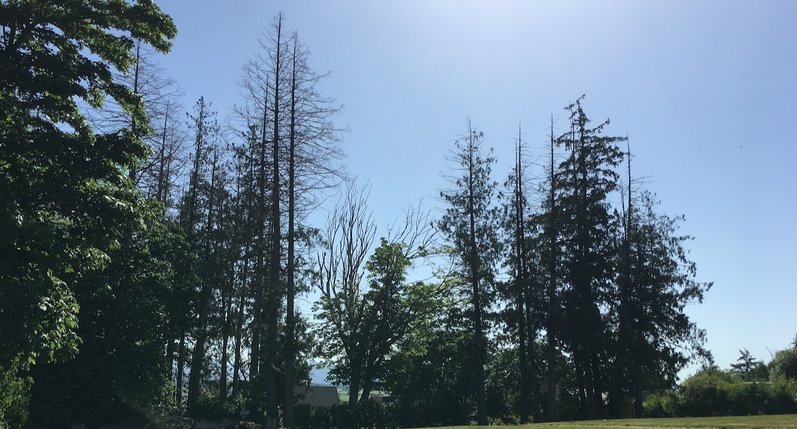

|            |            |            |            |
|:----------:|:----------:|:----------:|:----------:|
|[Redcedar](https://jmhulbert.github.io/open/redcedar)|[Data](https://jmhulbert.github.io/open/redcedar/data)|[ Analyses](https://jmhulbert.github.io/open/redcedar/analyses)|[Instructions](https://jmhulbert.github.io/open/redcedar/instructions)|
|             |           |            |            |

```{r setup, include=FALSE}
knitr::opts_chunk$set(echo = TRUE)
```



### Redcedar dieback

Increased levels of western redcedar dieback [have been linked to recent longer and hotter summer droughts](https://www.biorxiv.org/content/10.1101/2023.01.11.522134v1.full.pdf), which is tragic considering the cultural and ecological importance of this species.  Many critical questions remain about its vulnerability and survival going forward. 

***

### Community Science

More than 250 community scientists have [shared observations of healthy and unhealthy redcedar](https://www.inaturalist.org/projects/western-redcedar-dieback-map). These observations are invaluable for conducting spatial analyses to better understand the dieback of redcedar and reduce the impacts on our environments and communities. 

***

### Open Analyses

Given so many people have dedicated their time to helping learn about the dieback of western redcedar, it is important we include their data transparently in any analyses.

The purpose of this page is to organize efforts to conduct open analyses of the western redcedar dieback data shared on [iNaturalist](https://www.inaturalist.org/projects/western-redcedar-dieback-map). 

***

### Community

Anyone is welcome to contribute to these analyses. Together as a community, we are grateful for anyone willing to help. 

* Current contributors
  + Joey Hulbert, Postdoctoral Researcher, Washington State University
  + Brendan Farrell, Clockwork Micro
  + Rubén Rodriguez, private web software consultancy
  + *Your name here*


#### Join the Community {.tabset .tabset-fade}

Visit the tabs below to learn more about the tools to get involved. 

##### Github Repository

This webpage and the project list below are hosted in a [github repository](https://github.com/jmhulbert/open). 

Anyone is welcome to collaborate to add or make changes to the [github repository (https://github.com/jmhulbert/open)](https://github.com/jmhulbert/open). The content on this page is compiled using R Markdown.

##### Slack Workspace

We previously used a slack workspace, but because it is unpaid, it is not that useful for seeing past progress. Contact us if you're interested in working together in Slack. 

Note that you need a Slack account to join the Slack Community.

##### Miroboard

Contact us if you're interested in working together to brainstorm and map out ideas. 

You do not need a Miro account to access the board, but having an account may be helpful for linking contributions. 


####

***

### Contact

Contact Joey ([hulbe@wsu.edu](mailto:hulbe@wsu.edu)) if you're interested in contributing or have any questions. 
